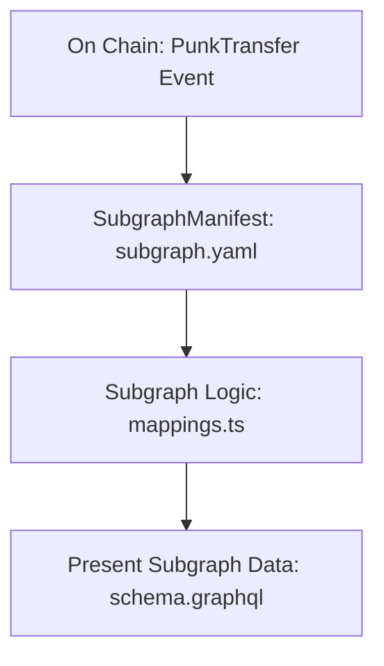

etherscan


cryptopun

https://etherscan.io/token/0xb47e3cd837ddf8e4c57f05d70ab865de6e193bbb#code

https://miniscan.xyz/

https://miniscan.xyz/?address=0xb47e3cd837ddf8e4c57f05d70ab865de6e193bbb&network=ethereum


ABI

https://miniscan.xyz/code?network=ethereum&address=0xb47e3cd837ddf8e4c57f05d70ab865de6e193bbb&codeType=ABI

abi.json


```bash
hiroshi@hiroshinoMac-mini thegraphquickstart04 % graph init --studio helloownerthegraph01
 ›   Warning: In next major version, this flag will be removed. By default we will deploy to the 
 ›   Graph Studio. Learn more about Sunrise of Decentralized Data 
 ›   https://thegraph.com/blog/unveiling-updated-sunrise-decentralized-data/
 ›   Warning: In next major version, this flag will be removed. By default we will deploy to the 
 ›   Graph Studio. Learn more about Sunrise of Decentralized Data 
 ›   https://thegraph.com/blog/unveiling-updated-sunrise-decentralized-data/
 ›   Warning: In next major version, this flag will be removed. By default we will stop initializing
 ›    a Git repository.
✔ Protocol · ethereum
✔ Subgraph slug · helloownerthegraph01
✔ Directory to create the subgraph in · helloownerthegraph01
? Ethereum network … 
✔ Ethereum network · mainnet
✔ Contract address · 0xb47e3cd837ddf8e4c57f05d70ab865de6e193bbb
✖ Failed to fetch ABI from Etherscan: ABI not found, try loading it from a local file
✔ Do you want to retry? (Y/n) · true
✖ Failed to fetch ABI from Etherscan: ABI not found, try loading it from a local file
✔ Do you want to retry? (Y/n) · true
✖ Failed to fetch ABI from Etherscan: ABI not found, try loading it from a local file
✔ Do you want to retry? (Y/n) · false
✖ Failed to fetch Start Block: Failed to fetch contract creation transaction hash
✔ Do you want to retry? (Y/n) · true
✖ Failed to fetch Start Block: Failed to fetch contract creation transaction hash
✔ Do you want to retry? (Y/n) · false
✖ Failed to fetch Contract Name: Failed to fetch contract source code
✔ Do you want to retry? (Y/n) · false
✔ ABI file (path) · /[full path]/abi.json

✔ Start Block · 3914495
✔ Contract Name · CryptoPunksMarket
✔ Index contract events as entities (Y/n) · true
  Generate subgraph
  Write subgraph to directory
✔ Create subgraph scaffold
✔ Initialize networks config
✔ Initialize subgraph repository
✔ Install dependencies with yarn
✔ Generate ABI and schema types with yarn codegen
Add another contract? (y/n): 
Subgraph helloownerthegraph01 created in helloownerthegraph01

Next steps:

  1. Run `graph auth` to authenticate with your deploy key.

  2. Type `cd helloownerthegraph01` to enter the subgraph.

  3. Run `yarn deploy` to deploy the subgraph.

Make sure to visit the documentation on https://thegraph.com/docs/ for further information.
```


https://thegraph.com/studio


click ```Create a Subgraph```

```
graph auth --studio [deploy key]

cd helloownerthegraph01

graph codegen && graph build

yarn deploy
```


```
hiroshi@hiroshinoMac-mini helloownerthegraph01 % yarn deploy
yarn run v1.22.19
$ graph deploy --node https://api.studio.thegraph.com/deploy/ helloownerthegraph01
Which version label to use? (e.g. "v0.0.1"): v0.0.1
  Skip migration: Bump mapping apiVersion from 0.0.1 to 0.0.2
  Skip migration: Bump mapping apiVersion from 0.0.2 to 0.0.3
  Skip migration: Bump mapping apiVersion from 0.0.3 to 0.0.4
  Skip migration: Bump mapping apiVersion from 0.0.4 to 0.0.5
  Skip migration: Bump mapping apiVersion from 0.0.5 to 0.0.6
  Skip migration: Bump manifest specVersion from 0.0.1 to 0.0.2
  Skip migration: Bump manifest specVersion from 0.0.2 to 0.0.4
✔ Apply migrations
✔ Load subgraph from subgraph.yaml
  Compile data source: CryptoPunksMarket => build/CryptoPunksMarket/CryptoPunksMarket.wasm
✔ Compile subgraph
  Copy schema file build/schema.graphql
  Write subgraph file build/CryptoPunksMarket/CryptoPunksMarket.json
  Write subgraph manifest build/subgraph.yaml
✔ Write compiled subgraph to build/
  Add file to IPFS build/schema.graphql
                .. QmUP7fS67ggsKLkTJ8E3GXcfYACc7MRSsjnS4dqG5BirqJ
  Add file to IPFS build/CryptoPunksMarket/CryptoPunksMarket.json
                .. QmWx8wq2Kf82bC529NWpFGXAvBSSoM7vm3kh8kBdUydNJg
  Add file to IPFS build/CryptoPunksMarket/CryptoPunksMarket.wasm
                .. QmdmhyicZQ4AnWi9ZUA6YbkG5NCL6vinStPomvMoNXYA66
✔ Upload subgraph to IPFS

Build completed: QmUEcxhQEYzuhjrebCKayHgrsZ9x6UhDYYRVyupFsrUDGx

Deployed to https://thegraph.com/studio/subgraph/helloownerthegraph01

Subgraph endpoints:
Queries (HTTP):     https://api.studio.thegraph.com/query/83242/helloownerthegraph01/v0.0.1

✨  Done in 19.72s.
```





